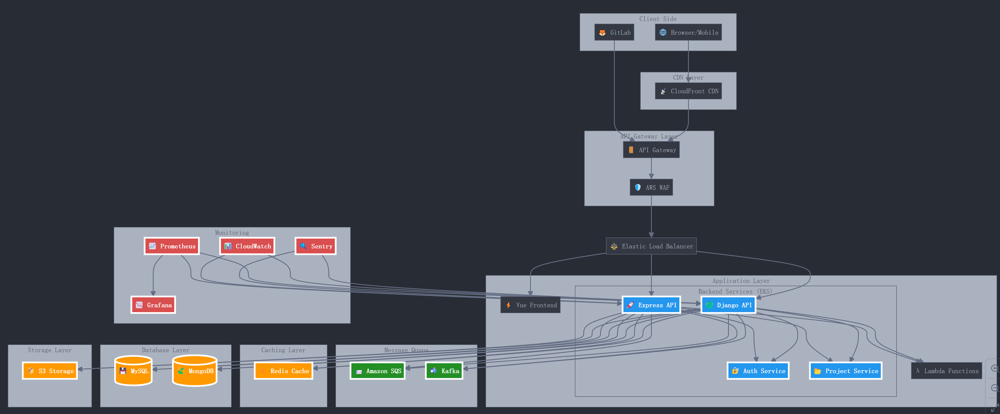

# 后端架构优化与技术升级方案 (AWS 环境)

本文档为快速增长的后端平台在 AWS 环境下提供的技术架构优化与升级方案。方案针对高并发、高数据量场景，从架构演进、数据存储与缓存、消息队列与大数据处理、监控与安全到性能优化和开发流程进行了全面的规划。

## 目标与原则

\*\*目标\*\*：

- 支撑从数万到十万级乃至更高数量级的构建提交量
- 在高并发、高数据量下保持高可用、高性能
- 保证系统的灵活扩展性和快速迭代能力

\*\*原则\*\*：

- \*\*可扩展性\*\*：可随流量与数据量弹性伸缩
- \*\*高可用性\*\*：冗余、容错与自动恢复
- \*\*解耦与模块化\*\*：微服务与异步通信降低耦合度
- \*\*高性能\*\*：缓存、索引优化、CDN 加速
- \*\*安全与合规\*\*：权限控制、数据加密、合规审计

## 架构演进

1. \*\*微服务化\*\*

   - 渐进式拆分：先独立比赛管理、用户系统、项目展示等关键模块
   - 使用 AWS EKS（Kubernetes）管理容器化微服务
   - 利用 Elastic Load Balancer 进行自动扩容与负载均衡

2. \*\*API 网关与服务发现\*\*

   - 使用 AWS API Gateway 作为统一入口，执行请求路由、认证与限流
   - 利用 AWS Cloud Map 或 EKS 内置机制实现服务发现

3. \*\*渐进式重构与数据迁移\*\*

   - 数据迁移过程中采用双写+灰度方案，确保平滑过渡
   - 阶段性验证与回滚机制降低迁移风险

## 数据存储与缓存

1. \*\*关系型数据库 (MySQL/Aurora)\*\*

   - RDS 上实现主从复制、读写分离
   - 根据项目 ID 范围进行分库分表，支持水平扩展

2. \*\*非关系型数据库 (MongoDB)\*\*

   - 部署分片集群，使用 Zone Sharding 将热点数据放置高性能节点

3. \*\*多级缓存策略\*\*

   - L1: 应用内缓存 (Caffeine)
   - L2: Redis (Amazon ElastiCache) 缓解数据库访问压力
   - L3: CloudFront CDN 对静态资源进行全局加速

4. \*\*对象存储与全文搜索\*\*

   - 使用 Amazon S3 存储文件、图片、附件
   - 引入 Amazon OpenSearch (Elasticsearch) 提升全文搜索与复杂查询性能

## 消息队列与异步处理

1. \*\*消息队列 (MQ)\*\*

   - 选择 Amazon SQS（轻量易用）或 Kafka（高吞吐）
   - 将项目提交审核、构建状态更新、评分计算、通知发送等任务异步化

2. \*\*数据管道与流处理\*\*

   - 使用 Amazon Kinesis 或 Kafka 收集用户行为和访问日志
   - 利用 Flink、Spark Streaming 在 EMR 上进行实时分析与计算
   - 大数据离线分析可结合 Redshift、Athena 实现定期批处理统计

## 计算层策略

1. \*\*弹性计算\*\*

   - 使用 Auto Scaling 根据流量动态扩容/缩容后端服务节点
   - 将突发任务交给 AWS Lambda 处理，无需持续占用计算实例

2. \*\*数据分析与数据湖\*\*

   - 在 S3 构建数据湖，使用 Glue 建立数据目录
   - 利用 Redshift、Athena 进行数据仓库分析，为业务策略提供数据支撑

## 监控、日志与告警

1. \*\*指标监控\*\*

   - 使用 Prometheus + Grafana 或 CloudWatch + Managed Grafana
   - 监控 P95/P99 响应时间、错误率、并发用户数、数据库连接数、缓存命中率

2. \*\*业务指标\*\*

   - 实时统计项目提交成功率、构建队列长度、活跃用户数、热门项目访问量

3. \*\*日志与追踪\*\*

   - 建立 EFK/ELK (OpenSearch + Fluentd/Logstash + Kibana) 日志平台
   - 使用 X-Ray、Jaeger 等分布式追踪工具快速定位性能瓶颈

## 安全性与合规

1. \*\*访问控制与防护\*\*

   - 利用 IAM、Security Group、WAF 实现精细化访问控制与攻击防护
   - 配置请求频率限制与黑白名单策略

2. \*\*数据加密与合规审计\*\*

   - 使用 KMS 加密敏感数据
   - 对敏感操作进行审计记录，定期安全扫描和渗透测试

## 性能优化与开发流程

1. \*\*性能优化\*\*

   - API 层：请求合并、字段过滤、分页优化
   - 数据层：索引优化、慢查询调优、读写分离
   - CDN 加速热数据与静态资源，降低用户访问时延

2. \*\*开发流程优化\*\*

   - 引入 Feature Flag，实现灰度发布与 A/B 测试
   - 完善 CI/CD 流程 (CodePipeline、CodeBuild、CodeDeploy) 持续集成与快速交付
   - 提高自动化测试覆盖率，保证高频迭代的质量稳定

## 总结

通过在 AWS 环境中分步骤实施微服务化、异步处理、分布式数据存储与缓存、实时流式分析、完善的监控与安全策略，以及持续改进开发流程，本方案可支持平台在快速增长的提交量与访问量下保持高可用、高性能和高灵活性。该方案为后端架构提供了清晰的演进路线和落地实践指导，助力平台持续快速、稳定地发展。

